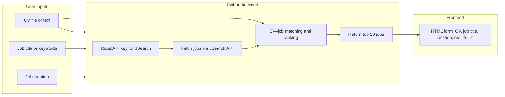

# CV–Job Matcher — Implementation Record

**Status: Complete and running**

**Stack:** Python backend (FastAPI), **JSearch** API (RapidAPI), plain HTML/CSS/JS frontend (no build step)

---

## How to run

```bash
cd cv-job-matcher/backend
.venv/bin/uvicorn app:app --port 8000
# open http://localhost:8000
```

The backend serves the frontend via FastAPI `StaticFiles` — no separate server needed.

---

## Architecture



---

## File structure

```
cv-job-matcher/
  backend/
    app.py            # FastAPI: /api/parse-cv, /api/parse-cv/json, /api/jobs, /api/match
    cv_parser.py      # PDF/DOCX/text → normalised plain text (pdfplumber, python-docx)
    job_sources.py    # JSearch API client (httpx, RapidAPI)
    matcher.py        # sentence-transformers cosine similarity, top-20 ranking
    requirements.txt  # fastapi, uvicorn, httpx, python-dotenv, pdfplumber, python-docx, sentence-transformers
    .venv/            # Python virtualenv (not committed)
  frontend/
    index.html        # Single-page form: CV upload/paste, job title, location, results
    style.css
    app.js            # Vanilla JS: calls backend, renders result cards
  .env                # RAPIDAPI_KEY, RAPIDAPI_HOST (not committed)
  .env.example        # Template for .env
  .gitignore
  README.md
```

---

## API routes

| Method | Path | Body | Returns |
|--------|------|------|---------|
| `POST` | `/api/parse-cv` | `multipart/form-data`: `file` (PDF/DOCX) or `text` (string) | `{ "text": "..." }` |
| `POST` | `/api/parse-cv/json` | `{ "text": "..." }` | `{ "text": "..." }` |
| `POST` | `/api/jobs` | `{ "location": "...", "job_title": "..." }` | `{ "jobs": [...] }` |
| `POST` | `/api/match` | `{ "cv_text": "...", "location": "...", "job_title": "..." }` | `{ "results": [...], "warning": "..." }` |
| `GET` | `/*` | — | Static frontend files |

---

## Implemented behaviours

### CV parsing (`cv_parser.py`)
- **PDF**: `pdfplumber` extracts text page by page.
- **DOCX**: `python-docx` extracts paragraphs.
- **Plain text**: accepted directly.
- All output is normalised: lowercase, stripped, whitespace collapsed.

### JSearch client (`job_sources.py`)
- Endpoint: `GET https://jsearch.p.rapidapi.com/search`
- Auth: `X-RapidAPI-Key` + `X-RapidAPI-Host` from `.env`.
- Query: built as `"{job_title} {location}"` (or just location if no title).
- Fetches **2 pages** (`num_pages=2`, ~20 jobs total).
  - ⚠️ Page 3+ consistently returns `null` for `job_description` — reduced from 3 to 2 pages for this reason.
- Maps response fields to a `Job` dataclass: `title`, `company`, `description`, `url`, `location`, `raw`.
- ⚠️ **JSearch coverage is US/UK/English-language only.** Queries for non-English markets (e.g. France, Germany) return 0 results.

### Matching (`matcher.py`)
- Model: `sentence-transformers` `all-MiniLM-L6-v2` (lazy-loaded on first use).
- CV text is encoded once; each job's `title + description` is encoded.
- Cosine similarity between CV embedding and each job embedding.
- **Only jobs with a non-empty description are scored.** Jobs without descriptions are appended unscored at the end if the top-20 isn't filled.
- Returns top 20 by score descending, with score as a float in `[0, 1]` (×100 for display).

### Match endpoint logic (`app.py`)
1. Build query: `"{job_title} {location}"`.
2. Fetch jobs from JSearch (2 pages).
3. **Fallback**: if 0 results, retry with job title only (handles limited-coverage locations).
4. If still 0 results, return `{ "results": [], "warning": "..." }` with an explanatory message.
5. Split jobs into `jobs_with_desc` / `jobs_without_desc`.
6. Score `jobs_with_desc`, append unscored remainder, return top 20.

### Frontend (`app.js`, `index.html`)
- File upload: sends DOCX/PDF to `POST /api/parse-cv`, uses returned text for matching.
- Textarea: CV text used directly.
- On submit: calls `POST /api/match`, renders result cards (title, company, location, score %, description snippet, apply link).
- Shows `warning` message from backend when no results are found.

---

## Known limitations

| Issue | Detail |
|-------|--------|
| JSearch geographic coverage | Only covers US/UK/English-language boards. Searches for French, German, or other non-English markets return 0 results. |
| JSearch free tier | ~200 requests/month. Each `/api/match` call uses 2 requests (2 pages). |
| Page 3+ null descriptions | JSearch returns `null` for `job_description` on page 3 and beyond for many queries. |
| Model cold start | `all-MiniLM-L6-v2` is loaded on first `/api/match` call — first request is slow (~5–10s). |

---

## Secrets

- `RAPIDAPI_KEY` and `RAPIDAPI_HOST` in `cv-job-matcher/.env` — never committed, never exposed to frontend.

---

## Deployment (not yet done)

Deploy Python backend to Railway, Render, or Fly.io with env vars set in the host dashboard. Frontend is served by the same process — no separate static hosting needed. Ensure HTTPS in production.
