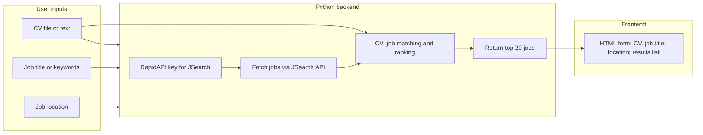

# LinkedIn CV–Job Matcher Web Application (Updated)

**Stack:** Python backend (FastAPI), **JSearch** API (RapidAPI), plain HTML/CSS/JS frontend (no build step)

**Decisions locked in:**
- **Location**: New folder `cv-job-matcher/` in this repo (ClaudeCodeTests).
- **Frontend**: Single HTML + CSS + vanilla JavaScript (no React/Vue, no build step).
- **Matching**: Sentence-transformers (semantic embeddings) for CV–job ranking.
- **Job search query**: User provides optional **"Job title or keywords"**; backend builds JSearch `query` as e.g. `"{job_title} {location}"`.

---

## Job data source: JSearch API

This plan uses **JSearch** as the job data source. JSearch is a job search API on RapidAPI that aggregates real-time job listings from **LinkedIn, Indeed, Glassdoor, ZipRecruiter, Monster**, and others through a single API. You get LinkedIn-sourced jobs plus other major boards without LinkedIn OAuth or partnership.

- **Provider**: [JSearch on RapidAPI](https://rapidapi.com/letscrape-6bRBa3QguO5/api/jsearch) (by Letscrape).
- **Auth**: Standard RapidAPI headers — `X-RapidAPI-Key` (your subscription key) and `X-RapidAPI-Host` (e.g. `jsearch.p.rapidapi.com`; confirm exact host in the RapidAPI dashboard).
- **Endpoints**: Job Search (primary), Job Details, Job Salary, Company Job Salary. Use the **Job Search** endpoint to fetch listings by query and location.
- **Pricing**: Free tier ~200 requests/month; Pro ~$25/mo for 10k requests. Each “find top 20” flow may use 1–2 requests (or more if you request multiple pages); stay within your plan’s limits.
- **Backend**: All requests and the API key stay in your **Python backend**; the frontend never sees the key.

---

## Architecture overview



- **Frontend**: Single-page HTML with form (CV upload/paste, optional job title, location) and results list; vanilla JS, no framework or build step.
- **Backend (Python)**: Handles JSearch (RapidAPI) key, job fetching via JSearch, CV parsing, **sentence-transformers** matching, and returns top 20 ranked jobs.

---

## Inputs

| Input | Description |
|-------|-------------|
| **CV** | File upload (PDF/DOCX) or pasted plain text. Backend extracts text for matching. |
| **Job title or keywords** | Optional. User types e.g. "Software Engineer", "Data Scientist". Combined with location to build JSearch `query` (e.g. "Software Engineer London"). |
| **Location** | Free text (e.g. "London", "Remote", "New York"). Combined with job title in JSearch **query**. |

No LinkedIn sign-in; JSearch uses your RapidAPI key only.

---

## Detailed implementation steps

### Phase 1: Project setup and Python backend

1. **Stack**
   - **Backend**: Python with **FastAPI** (or Flask). FastAPI is recommended for async and automatic OpenAPI docs.
   - **Frontend**: Single HTML + CSS + vanilla JS (no build step); calls backend REST API from the browser.
   - **Secrets**: Store your JSearch/RapidAPI key in `.env` as `RAPIDAPI_KEY` (and optionally `RAPIDAPI_HOST` for the JSearch host); load with `python-dotenv`.

2. **Python project skeleton**
   - Create `cv-job-matcher/backend/` with `requirements.txt`: FastAPI, uvicorn, httpx, python-dotenv, pdfplumber, python-docx, **sentence-transformers** (and torch/cpu or GPU as needed).
   - Routes:
     - `POST /api/parse-cv` — accepts file or JSON `{ "text": "..." }`, returns extracted/normalized plain text.
     - `POST /api/jobs` — body `{ "location": "...", "job_title": "..." }` (optional job_title); backend builds JSearch `query` as `"{job_title} {location}"`, returns list of jobs in common shape.
     - `POST /api/match` — body `{ "cv_text": "...", "location": "...", "job_title": "..." }`; backend fetches jobs via JSearch, runs **sentence-transformers** matcher, returns top 20 with scores.
   - Enable CORS for your frontend origin.

3. **CV parsing (Python)**
   - **PDF**: Use `pdfplumber` or `PyPDF2` to extract text.
   - **DOCX**: Use `python-docx` to extract paragraphs.
   - Normalize text (lowercase, strip, collapse spaces) and return a single string for matching.

### Phase 2: JSearch API integration

4. **JSearch subscription and credentials**
   - Subscribe to **JSearch** on RapidAPI: [rapidapi.com/letscrape-6bRBa3QguO5/api/jsearch](https://rapidapi.com/letscrape-6bRBa3QguO5/api/jsearch).
   - In the RapidAPI dashboard, copy your **X-RapidAPI-Key** and the **Host** value for JSearch (e.g. `jsearch.p.rapidapi.com`). Add these to `.env` as `RAPIDAPI_KEY` and `RAPIDAPI_HOST`.

5. **JSearch Job Search endpoint**
   - **Endpoint**: Use the **Job Search** endpoint (exact path in RapidAPI docs; often something like `GET /search` or similar — confirm in the API’s “Endpoints” tab).
   - **Headers**: `X-RapidAPI-Key`, `X-RapidAPI-Host`.
   - **Query parameters** (confirm names in JSearch docs):
     - **query** — search string; build from user’s optional **job title** + **location** (e.g. `"Software Engineer London"` or `"Remote"` if no job title).
     - **page** — page number (1–100).
     - **num_pages** — number of pages per request (1–20; each page ~10 results). Request 2–3 pages if you need more than 10 jobs before matching.
     - **date_posted** — optional: `all`, `today`, `3days`, `week`, `month`.
     - **employment_types** — optional: `FULLTIME`, `CONTRACTOR`, `PARTTIME`, `INTERN` (comma-separated).
     - **remote_jobs_only** — optional: boolean for remote-only.
   - Response: array of jobs with 40+ fields; typically `job_title`, `employer_name`, `job_description`, `job_apply_link`, `job_city`, `job_country`, etc. Map these to your common job shape.

6. **Implement JSearch client in Python**
   - In `backend/job_sources.py`: use `httpx` to call the JSearch Job Search endpoint with `query` = `"{job_title} {location}"` (from user form), `page`, and `num_pages`.
   - Parse the JSON response and map each item to a common **job shape**: e.g. `title`, `company`, `description`, `url`, `location` (from `job_city`/`job_country` or equivalent).
   - Handle errors and rate limits (respect RapidAPI rate limits; add retries with backoff if needed).

7. **Unify job shape**
   - Use a single Pydantic model or dataclass for a “job” so the matching step is independent of JSearch’s response format.

### Phase 3: CV–job matching and ranking (Python)

8. **Text for matching**
   - Use parsed CV text and each job’s `title` + `description` (and optionally `location`/`company` if you want them in the score).

9. **Matching strategy (locked: sentence-transformers)**
   - Use **sentence-transformers** (e.g. `all-MiniLM-L6-v2`): encode CV text once, encode each job’s title+description, compute **cosine similarity** between CV embedding and each job embedding, then rank by score. Handles synonyms and different wording well. Include `sentence-transformers` (and PyTorch) in `requirements.txt`; CPU is fine for moderate job list sizes.

10. **Top 20**
    - Sort jobs by match score descending; return the top 20 with score (e.g. 0–100%) attached.

### Phase 4: Frontend and UX

11. **Form fields (plain HTML)**
    - **CV**: file input (PDF/DOCX) and/or textarea for pasted CV. Send to `POST /api/parse-cv` or include parsed text in `POST /api/match`.
    - **Job title or keywords**: optional text input; sent as `job_title` in match request.
    - **Location**: required text input; sent with job fetch + match.

13. **“Find my best jobs” action**
    - Button that calls `POST /api/match` (or a flow that fetches jobs then matches). Show loading state.

14. **Results list**
    - Display top 20: title, company, location, match score (e.g. “85% match”), link to job. Optionally show a short snippet of the job description.

### Phase 5: Security and deployment

15. **Secrets**
    - Keep the JSearch/RapidAPI key only in backend `.env`; never expose it to the frontend.

16. **Deploy**
    - Deploy Python backend (e.g. Railway, Render, Fly.io, or a VPS) with env vars set in the host. Serve or deploy frontend (static or same server). Ensure CORS and HTTPS in production.

---

## Suggested file structure (Python + Option B)

```
cv-job-matcher/           # inside this repo (ClaudeCodeTests)
  backend/
    app.py                # FastAPI: parse-cv, jobs, match (with job_title + location)
    cv_parser.py          # PDF/DOCX → text (pdfplumber, python-docx)
    job_sources.py        # JSearch client: query = job_title + location
    matcher.py            # sentence-transformers + cosine similarity, top 20
    requirements.txt     # fastapi, uvicorn, httpx, python-dotenv, pdfplumber, python-docx, sentence-transformers
  frontend/
    index.html            # single page: form (CV, job title, location) + results
    style.css
    app.js                # vanilla JS, fetch to backend
  .env.example            # RAPIDAPI_KEY, RAPIDAPI_HOST (JSearch)
```

---

## Summary checklist

1. Create `cv-job-matcher/` in this repo; set up Python backend (FastAPI) and plain HTML/CSS/JS frontend; add `.env` with `RAPIDAPI_KEY` and `RAPIDAPI_HOST` for JSearch.
2. Implement CV parsing in Python (PDF/DOCX + plain text).
3. Subscribe to **JSearch** on RapidAPI; implement JSearch client in `job_sources.py` (Job Search, `query` = job_title + location, `page`/`num_pages`); normalize to common job shape.
4. Implement **sentence-transformers** matcher in `matcher.py` and top-20 ranking.
5. Expose `parse-cv`, `jobs`, and `match` API routes (match accepts `cv_text`, `location`, `job_title`).
6. Build single-page UI: CV (file + paste), optional job title, location, “Find jobs,” results list with scores and links.
7. Deploy backend and frontend; test with real CV and location.
