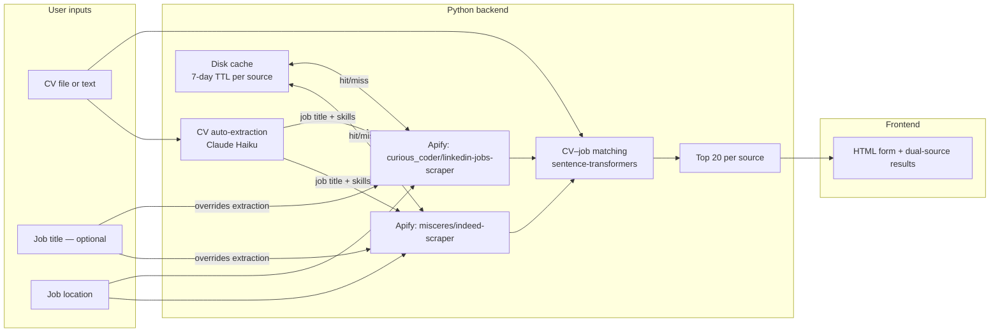

# CV–Job Matcher — Implementation Record

**Status: v2.0.0 — Complete and running**

**Stack:** Python backend (FastAPI), **Apify** (Indeed + LinkedIn scrapers), Claude Haiku (CV profile extraction), plain HTML/CSS/JS frontend (no build step)

---

## How to run

```bash
cd cv-job-matcher/backend
.venv/bin/uvicorn app:app --port 8000
# open http://localhost:8000
```

The backend serves the frontend via FastAPI `StaticFiles` — no separate server needed.

---

## Architecture



---

## File structure

```
cv-job-matcher/
  backend/
    app.py            # FastAPI: /api/parse-cv, /api/jobs, /api/match, /api/cache/status
    cv_parser.py      # PDF/DOCX/text → plain text (pdfplumber, python-docx)
    cv_profiler.py    # CV auto-extraction via Claude Haiku (job title + skills)
    job_sources.py    # Apify actors: indeed-scraper + linkedin-jobs-scraper
    job_cache.py      # Per-source disk cache (7-day TTL, md5 keyed)
    matcher.py        # sentence-transformers cosine similarity, top-20 ranking
    requirements.txt
    .venv/            # Python virtualenv (not committed)
  frontend/
    index.html        # Single-page form: CV upload/paste, job title, location, dual results
    style.css
    app.js            # Vanilla JS: calls backend, renders Indeed + LinkedIn sections
  .env                # ANTHROPIC_API_KEY, APIFY_API_TOKEN, APIFY_COUNTRY (not committed)
  .env.example        # Template for .env
  .gitignore          # includes .env, .venv/, job_cache/
```

---

## API routes

| Method | Path | Body | Returns |
|--------|------|------|---------|
| `POST` | `/api/parse-cv` | `multipart/form-data`: `file` (PDF/DOCX) or `text` | `{ "text": "..." }` |
| `POST` | `/api/parse-cv/json` | `{ "text": "..." }` | `{ "text": "..." }` |
| `POST` | `/api/jobs` | `{ "location": "...", "job_title": "..." }` | `{ "jobs": [...], "cache_info": {...} }` |
| `POST` | `/api/match` | `{ "cv_text": "...", "location": "...", "job_title": "...", "force_refresh": bool }` | `{ "indeed": [...], "linkedin": [...], "cache_info": {...}, "extracted_profile": {...} }` |
| `GET` | `/api/cache/status` | — | `{ "entries": [...], "monthly_usage": {...} }` |
| `GET` | `/*` | — | Static frontend files |

---

## Implemented behaviours

### CV parsing (`cv_parser.py`)
- **PDF**: `pdfplumber` extracts text page by page.
- **DOCX**: `python-docx` extracts paragraphs.
- **Plain text**: accepted directly.

### CV auto-extraction (`cv_profiler.py`)
- Called when no job title is provided by the user.
- Sends CV text (truncated to 3000 chars) to `claude-haiku-4-5` with a JSON-returning prompt.
- Returns `{ "job_title": "...", "skills": "..." }`.
- Extracted job title is used as the Apify search keyword.
- Extracted skills are appended to the CV text (`"\nKey skills: ..."`) before cosine scoring, enriching the embedding.
- Gracefully returns empty strings if `ANTHROPIC_API_KEY` is absent or the call fails — app continues without extraction.

### Job fetching (`job_sources.py`)
- **Indeed** (`misceres/indeed-scraper`): passes `position`, `location`, `maxItems`, and an ISO country code (`country`). The country is auto-detected from the location string (e.g. `"Paris"` → `FR`, `"London"` → `GB`) via a keyword map, with `APIFY_COUNTRY` as the fallback default. Pricing: $0.005/result.
- **LinkedIn** (`curious_coder/linkedin-jobs-scraper`): builds a `linkedin.com/jobs/search/?keywords=...&location=...` URL and passes it to the actor. Results are capped by slicing after the run. Pricing: $0.001/result.
- Both are run concurrently via `asyncio.gather()` / `asyncio.to_thread()`.

### Caching (`job_cache.py`)
- Results are stored as JSON on disk under `backend/job_cache/`.
- Cache key: `md5(f"{keyword}|{location}|{source}")`.
- TTL: 7 days. Stale entries are served with a cache-bar notification in the UI.
- `force_refresh=true` in the request bypasses the cache and re-fetches from Apify.
- `GET /api/cache/status` reports all cached searches and estimated monthly Apify spend.

### Matching (`matcher.py`)
- Model: `sentence-transformers` `all-MiniLM-L6-v2` (lazy-loaded on first use).
- Scored independently per source — top 20 Indeed + top 20 LinkedIn.
- Only jobs with a non-empty description are scored; unscored jobs pad the list if needed.
- Returns score as float in `[0, 1]` (×100 for display as `XX.X% match`).

### Match endpoint logic (`app.py`)
1. If no job title provided and CV text is non-empty, auto-extract profile via Claude Haiku.
2. Fetch Indeed and LinkedIn concurrently (cache-first).
3. Deduplicate across sources by `(title, company)`.
4. Score each source's jobs independently against the (optionally augmented) CV text.
5. Return `{ "indeed": [top 20], "linkedin": [top 20], "cache_info": {...}, "extracted_profile": {...} }`.

### Frontend (`app.js`, `index.html`, `style.css`)
- **File upload**: sends PDF/DOCX to `POST /api/parse-cv`, uses returned text for matching.
- **CV textarea**: text used directly if no file uploaded.
- **Profile bar**: shown when auto-extraction produced a result — displays detected job title and skills.
- **Cache bar**: shown when results are served from cache — displays age and expiry, with a "Refresh job listings" button.
- **Dual result sections**: Indeed and LinkedIn displayed separately, each with source badge, match score, company, location, description snippet, and apply link.
- **Error handling**: errors scroll into view automatically.

---

## Environment variables

| Variable | Required | Description |
|----------|----------|-------------|
| `APIFY_API_TOKEN` | ✅ | Apify account token |
| `APIFY_COUNTRY` | optional | Fallback ISO country code for Indeed (default: `US`). Auto-detected from location when possible. |
| `APIFY_INDEED_ACTOR_ID` | optional | Default: `misceres/indeed-scraper` |
| `APIFY_INDEED_MAX_RESULTS` | optional | Default: `25` |
| `APIFY_LINKEDIN_ACTOR_ID` | optional | Default: `curious_coder/linkedin-jobs-scraper` |
| `APIFY_LINKEDIN_MAX_RESULTS` | optional | Default: `50` |
| `APIFY_LINKEDIN_TIMEOUT_SECS` | optional | Default: `90` |
| `ANTHROPIC_API_KEY` | optional | Enables CV auto-extraction via Claude Haiku. App works without it. |

---

## Known limitations

| Issue | Detail |
|-------|--------|
| Apify cost per search | 25 Indeed ($0.125) + 50 LinkedIn ($0.05) = **$0.175/unique search**. Apify free tier is $5/month → ~28 unique searches/month. Cache mitigates this significantly. |
| LinkedIn actor timeout | `curious_coder/linkedin-jobs-scraper` runs until timeout (90s default) rather than stopping at a result count. Results are capped post-run. |
| Indeed country detection | Auto-detection covers major cities/countries. Obscure locations fall back to `APIFY_COUNTRY`. |
| Model cold start | `all-MiniLM-L6-v2` is loaded on first `/api/match` call — first request is slow (~5–10s). |

---

## Secrets

- `ANTHROPIC_API_KEY` and `APIFY_API_TOKEN` in `cv-job-matcher/.env` — never committed, never exposed to frontend.

---

## Deployment (not yet done)

Deploy Python backend to Railway, Render, or Fly.io with env vars set in the host dashboard. Frontend is served by the same process — no separate static hosting needed. Ensure HTTPS in production.
